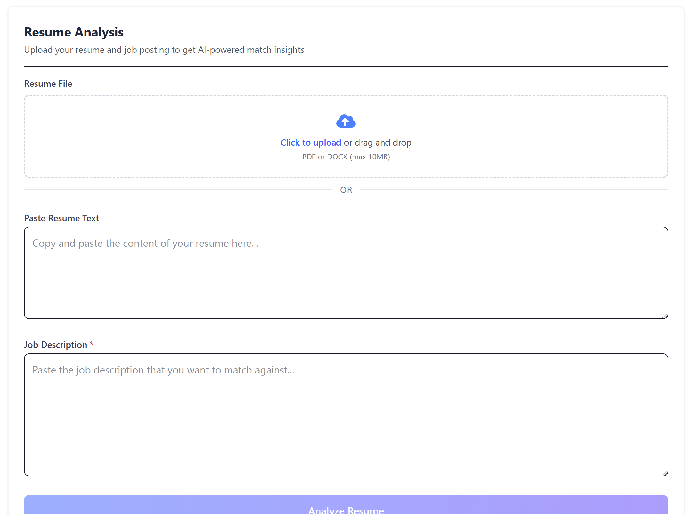

# MatchMyEmployee

**AI-Powered Resume & Job Match Analysis**  
Unlock smarter hiring and career decisions with MatchMyEmployee — a full-stack application that leverages advanced AI models to analyze resumes against job descriptions, providing actionable insights, match scores, and improvement suggestions.

---

## 🚀 Features

- **Resume & Job Description Analysis:**  
    Upload your resume (PDF/DOCX or text) and a job posting to receive a detailed AI-powered match report.

- **Model Selection:**  
    Choose from multiple AI models (including free and premium options) for analysis.  
    *Default: Free models available for everyone.*

- **Insightful Results:**  
    - Overall match score (with breakdown: skills, experience, education)
    - Reliability & learning potential metrics
    - Key achievements (directly relevant & transferable)
    - Red flags and suspicious claims detection
    - Areas for improvement

- **Modern UI:**  
    Beautiful React + Tailwind CSS interface with intuitive navigation, drag-and-drop file upload, and real-time feedback.

- **FastAPI Backend:**  
    Robust Python backend connects to OpenRouter for LLM-powered analysis, supports file parsing (PDF/DOCX), and exposes a clean REST API.

---

## 🖥️ Tech Stack

- **Frontend:**  
    - React 19 + TypeScript  
    - Vite  
    - Tailwind CSS  
    - React Icons, React Tooltip

- **Backend:**  
    - FastAPI  
    - Python  
    - pdfplumber, python-docx  
    - httpx (async OpenRouter API calls)

- **AI Integration:**  
    - OpenRouter API (multi-model support)

---

## 📦 Project Structure

```
matchmyemployee/
├── backend/
│   ├── main.py           # FastAPI app, OpenRouter integration, file parsing
│   ├── .env              # OpenRouter API key
│   └── ...               # Python dependencies, configs
├── frontend/
│   ├── src/
│   │   ├── App.tsx       # Main React app
│   │   ├── components/   # ModelSelector, ResumeForm, ResultsDisplay
│   │   └── main.tsx      # Entry point
│   ├── index.html        # App shell
│   ├── index.css         # Tailwind setup
│   ├── vite.config.ts    # Vite config
│   ├── package.json      # Dependencies & scripts
│   └── ...               # ESLint, tsconfig, .env
└── README.md             # You're here!
```

---

## ⚡ Quick Start

### 1. Backend (FastAPI)

```bash
cd backend
python -m venv venv
source venv/bin/activate  # or venv\Scripts\activate on Windows
pip install fastapi uvicorn httpx pdfplumber python-docx
# Add your OpenRouter API key to .env
uvicorn main:app --reload --port 8006
```

### 2. Frontend (React + Vite)

```bash
cd frontend
npm install
npm run dev
```

- The frontend expects the backend at `http://127.0.0.1:8006` (see `.env`).

---

## 📝 Usage

1. **Select AI Model:**  
     Pick a free or premium model for analysis.

2. **Upload Resume & Job Description:**  
     - Drag & drop PDF/DOCX or paste resume text.
     - Paste job description.

3. **Analyze:**  
     Click "Analyze Resume" and view detailed results, including match scores, strengths, and improvement areas.

4. **Try Different Models:**  
     If you encounter issues, switch models for better results.

---

## 🔒 Security & Privacy

- Your data is processed locally and sent only to the selected AI model via OpenRouter.
- No resumes or job descriptions are stored.

---

## 💡 Customization & Extensibility

- **Add More Models:**  
    Backend fetches available models from OpenRouter dynamically.
- **UI Customization:**  
    Easily extend React components for new features or branding.
- **API Integration:**  
    Use the backend endpoints for custom workflows or integrations.

---

## 🤝 Contributing

Pull requests, issues, and suggestions are welcome!  
Help improve MatchMyEmployee for job seekers and recruiters everywhere.

---

## 📄 License

This project is open source under the MIT License.

---
## 🌟 Screenshots

<div align="center">


<br/>


</div>

<p align="center"><em>Modern UI, easy model selection, and actionable results.</em></p>

---

## 📬 Contact

Questions or feedback?  
Open an issue or reach out via GitHub!

---

**Empower your career and hiring decisions with AI. Try MatchMyEmployee today!**